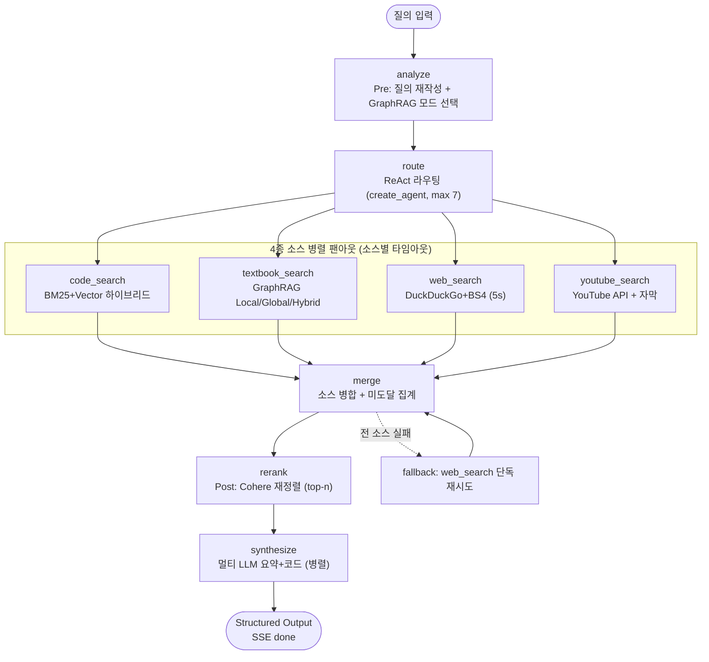

# code-finder 통합 검색 백엔드 API

## 개요

교재(GraphRAG)·예제 코드(Vector DB)·웹·유튜브 **4종 소스**를 LangGraph MAS로 통합 검색하여,
학습자 질문에 **핵심 요약 + 예제 코드 + 출처**를 SSE로 스트리밍하는 백엔드 검색 API 서비스임.

주요 기능
- LangGraph StateGraph 단일 MAS — 질의 분석(Pre) → ReAct 4도구 병렬 팬아웃 → 병합 → 리랭킹(Post) → 멀티 LLM 합성
- 4종 소스 병렬 팬아웃 + 소스별 타임아웃 + 부분결과 스트리밍(도달 시간 KPI 보호)
- 멀티 LLM 태스크별 라우팅(Groq·Claude·OpenAI·Gemini) + Groq 폴백
- Structured Output 최종 응답(환각 차단 — 근거 있는 내용만)
- RAGAS + NDCG 검색 품질 회귀 평가

## MAS 그래프 구성



노드 간 데이터 공유는 StateGraph의 State(Reducer)로 구현함(`app/search/state.py`).
세션 체크포인트는 **SqliteSaver**(비동기 `AsyncSqliteSaver`, `app/checkpoints/search.sqlite`)를 사용함.

## API 계약 (정본)

프론트엔드(`prompts/frontend.md`)가 소비하는 계약의 정본임.

### `POST /search`

요청
```json
{"query": "LangGraph에서 StateGraph 만드는 법", "llm": "claude"}
```
- `query`(필수): 학습자 질문
- `llm`(선택, `claude`|`openai`|`gemini`): 합성 모델 힌트. 미지정 시 태스크별 자동 라우팅

응답: **부분 결과 SSE 스트리밍 → `done`에 최종 Structured Output**. 각 event data는 최종 스키마 필드명 사용.

| event | data | 시점 |
|-------|------|------|
| `missing` | `{"missing_sources": ["youtube"]}` | route 완료 |
| `source` | `{"type","ref"\|"url","score","fetched_at"?}` (건별) | rerank 완료 |
| `summary` | `{"summary": "..."}` | synthesize 완료 |
| `code` | `{"lang","code","explain","source"}` (건별) | synthesize 완료 |
| `done` | 최종 SearchAnswer 전체 | 종료 |

최종 Structured Output(SearchAnswer)
```json
{
  "query": "원 질의 에코",
  "summary": "핵심 요약",
  "code_examples": [{"lang":"python","code":"...","explain":"...","source":"16.mas/.../workflow.py#create_workflow#34"}],
  "sources": [
    {"type":"code","ref":"<chunk_id>","score":0.98},
    {"type":"textbook","ref":"ent_state_graph","score":0.93},
    {"type":"web","url":"https://...","fetched_at":"2026-07-16T00:00:00Z","score":0.72},
    {"type":"youtube","url":"https://youtu.be/...","fetched_at":"...","score":0.65}
  ],
  "missing_sources": ["youtube"],
  "used_models": {"routing":"groq/openai/gpt-oss-120b","summary":"openai/gpt-4o-mini","code_synthesis":"claude/claude-sonnet-5"}
}
```
- code 소스의 `source`/`ref`는 `indexing-code.md` 계약의 `chunk_id`(`{상대경로}#{symbol}#{start_line}`)를 그대로 사용
- textbook `ref`는 엔티티 ID(`ent_<slug>`), web·youtube는 `url`+`fetched_at`
- `used_models`는 **실제 사용 모델**을 정직하게 반영(폴백 시 폴백 모델명 표기)

### `GET /health`
Chroma 청크 수·Neo4j 통계·provider 키 설정 여부를 반환함.

## 멀티 LLM 라우팅 정책 (근거)

| 태스크 | provider [모델] | 선택 근거 |
|--------|-----------------|-----------|
| ReAct 도구 라우팅 | **Groq** [`openai/gpt-oss-120b`] | LPU 저지연 — 병렬 도구 라우팅 반복에 적합, temperature 0·timeout 30s·429 백오프 2회 |
| 코드 설명·예제 합성 | **Claude** [`claude-sonnet-5`] | 코드 이해·설명 강점 |
| 개념 요약·다국어 | **OpenAI** [`gpt-4o-mini`] (기본) / **Gemini** (대안) | 비용·속도 |
| 폴백 | **Groq** | provider 호출 실패(키 무효·타임아웃) 시 기본 폴백 |

- 요청 `llm` 힌트 지정 시 요약·코드 합성 양쪽을 해당 provider로 강제
- 라우팅 정책은 `app/common/config.py`(config)로 관리, 모델은 `LLM_*` 환경변수로 override

## GraphRAG 검색 모드 선택 규칙 (§3.5)

질의 텍스트 신호로 판정, 판단 모호 시 **Hybrid** 기본값(`kg/retriever/mode_select.py`).

| 모드 | 조건(신호) | 검색 방식 |
|------|-----------|-----------|
| Local | 특정 개체 중심 정의형("뭐예요/무엇/정의/뜻") | chunk_vector 랭킹 청크 + entity_vector 엔티티·1홉 관계 |
| Global | 주제 요약·탐색형("관련 개념/종류/정리/뭐가 있어요") | 관련 엔티티의 커뮤니티 요약 집계 + 근거 청크 |
| Hybrid | 관계형("관계/차이/vs")·멀티홉("전에/선행/순서")·반론·모호 | Local + Global 통합 |

## RAG 하이브리드 리트리버 (§3.4)

- BM25(0.4) + Chroma Vector(0.6) `EnsembleRetriever`, 벡터 서치타입 `mmr`, top-k 5, fetch-k 10
- 인덱서(`rag/indexer`) 산출 Chroma 컬렉션 `code_chunks`(2,682 청크)를 소비

## 검색 처리 기법 (§3.6)

- Pre[기준]: 질의 특성에 따라 Query Rewriting / Multi Query / HyDE / Step-back 선택(Groq, 단일 호출)
- Post[고정]: Cohere `rerank-multilingual-v3.0`으로 병합 결과 재정렬

## 디렉토리 구조

```
app/
  main.py               # FastAPI 진입점 (POST /search SSE, GET /health)
  common/
    config.py           # .env 로더·provider/타임아웃/체크포인터 설정
    schemas.py          # API 계약 스키마 (SearchRequest/SearchAnswer/Source/...)
    llm_router.py       # 멀티 LLM 라우터 (태스크→provider, Groq 폴백)
    logging_utils.py    # 단계·건수·선택 경로 로깅
  search/
    state.py            # StateGraph State(Reducer)
    query_analysis.py   # Pre: 질의 분석·재작성
    tools.py            # ReAct 4종 검색 도구(병렬 팬아웃·타임아웃·부분결과)
    rerank.py           # Post: Cohere 리랭킹
    synthesize.py       # 멀티 LLM 요약·코드 합성(근거 검증)
    graph.py            # StateGraph 조립·실행
  eval/
    run_eval.py         # RAGAS + NDCG 평가
    ragas_compat.py     # ragas↔langchain-community 호환 shim
rag/retriever/          # 코드 하이브리드 리트리버(BM25+Vector)
kg/retriever/           # 교재 GraphRAG 리트리버(Local/Global/Hybrid)
crawler/web/            # DuckDuckGo + BeautifulSoup 웹 수집
crawler/youtube/        # YouTube Data API + 자막 수집
```

## 가상환경 설정 및 실행

의존성은 프로젝트 루트 `requirements.txt`에 정의됨(Python 3.12+).

### 가상환경 활성화

Linux / macOS
```bash
python3 -m venv .venv
source .venv/bin/activate
pip install -r requirements.txt
```

Windows GitBash
```bash
python -m venv .venv
source .venv/Scripts/activate
pip install -r requirements.txt
```

Windows PowerShell
```powershell
python -m venv .venv
.\.venv\Scripts\Activate.ps1
pip install -r requirements.txt
```

### 환경변수

`.env.example`을 참고하여 프로젝트 루트 `.env`에 키를 설정함
(`GROQ_API_KEY`·`OPENAI_API_KEY`·`CLAUDE_API_KEY`·`GEMINI_API_KEY`·`COHERE_API_KEY`·`YOUTUBE_API_KEY`·Neo4j 접속정보).
선행 인덱스가 필요함: 코드 인덱스(`rag/store/chroma/`), 교재 KG(Neo4j `code-finder-neo4j`, 포트 7690).

### 서버 실행

```bash
# 프로젝트 루트에서
uvicorn app.main:app --host 0.0.0.0 --port 8000
```

호출 예
```bash
curl -N -X POST http://localhost:8000/search \
  -H "Content-Type: application/json" \
  -d '{"query":"LangGraph로 상태 공유하는 멀티 에이전트 만드는 법"}'

curl http://localhost:8000/health
```

### 테스트

```bash
python -m pytest              # 단위 테스트(외부 API Mock, integration 제외)
python -m pytest -m integration   # 통합 테스트(실제 Chroma·Neo4j·LLM 호출)
```

### 검색 품질 평가

```bash
python -m app.eval.run_eval --dataset both        # 전체 테스트셋
python -m app.eval.run_eval --dataset rag --limit 5   # 일부만
```
결과는 `datasets/eval-report.json`(지표별 실측 평균·NDCG·버전·일시)에 저장됨.

## 알려진 제약

- `.env`의 `COHERE_API_KEY`는 과거 오탈자(`COHREE_API_KEY`) 폴백을 함께 조회함.
- ragas 0.4.x는 제거된 `langchain_community.chat_models.vertexai`를 하드 import하므로
  `app/eval/ragas_compat.py`의 shim을 ragas import 전에 설치함(VertexAI 미사용).
- 웹 검색의 "최근 6개월"은 DuckDuckGo 시간창 한계로 `timelimit`(연 단위) 근사이며,
  신선도는 `fetched_at`(수집 시각) 메타데이터 기준으로 적용함.
- 유튜브 자막은 IP 차단 완화를 위해 Webshare 프록시(설정 시)를 우선 사용하고, 실패 시 직접 재시도함.
