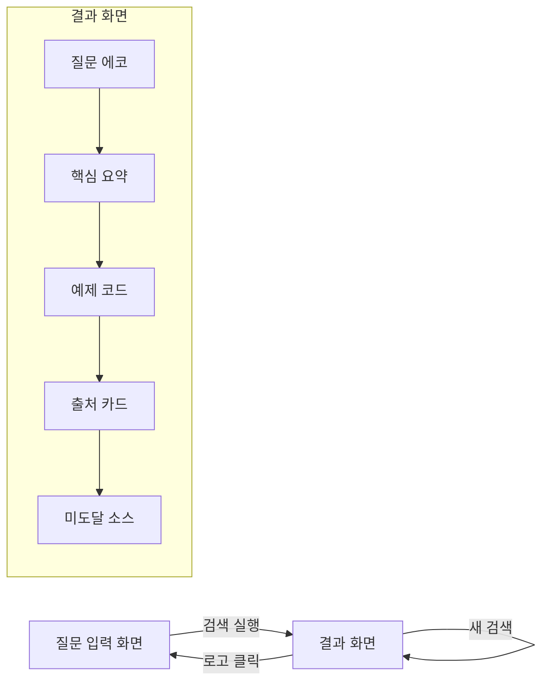

# code-finder 프론트엔드

학습자 질문에 맞는 핵심 내용과 예제 코드를 한 화면에 제공하는 Vue 3 SPA.  
Google 검색 스타일의 단순한 입력 화면과 4종 소스(교재/코드/웹/영상) 통합 결과 렌더링.

## 기술 스택

- **Vue 3** (Composition API, `<script setup>`) + **TypeScript**
- **Vite** 빌드 도구
- **Pinia** 상태 관리
- **Vue Router** 클라이언트 라우팅
- **highlight.js** 코드 문법 하이라이트
- **Vitest** + **@vue/test-utils** 테스트

## 화면 흐름



## 디렉토리 구조

```
front/
├── src/
│   ├── api/                    # API 클라이언트·타입·SSE 파서·mock
│   │   ├── types.ts            # 백엔드 계약 타입 정의
│   │   ├── sse-parser.ts       # SSE 라인 버퍼 파서
│   │   ├── mock.ts             # mock SSE 스트림 (3종 시나리오)
│   │   ├── client.ts           # fetch 기반 검색 API 클라이언트
│   │   └── index.ts            # re-export
│   ├── stores/
│   │   └── search.ts           # Pinia 검색 상태 스토어
│   ├── views/
│   │   ├── SearchView.vue      # 질문 입력 화면 (Google-like)
│   │   └── ResultView.vue      # 통합 결과 화면
│   ├── components/
│   │   ├── SearchBar.vue       # 검색 입력창
│   │   ├── LlmSelect.vue       # LLM 선택 드롭다운
│   │   ├── ExampleChips.vue    # 예시 질문 칩
│   │   ├── ResultSummary.vue   # 핵심 요약 표시
│   │   ├── CodeBlock.vue       # 코드 블록 (하이라이트+복사)
│   │   ├── SourceCard.vue      # 출처 카드 (유형 배지+score)
│   │   ├── LoadingSkeleton.vue # 로딩 스켈레톤
│   │   ├── ErrorRetry.vue      # 에러+재시도 버튼
│   │   └── MissingSourcesBadge.vue # 미도달 소스 배지
│   ├── router/
│   │   └── index.ts            # 라우트 정의
│   ├── App.vue                 # 루트 컴포넌트
│   ├── main.ts                 # 앱 진입점
│   └── style.css               # 글로벌 스타일
├── .env.example                # 환경변수 예시
├── package.json
├── vite.config.ts
├── vitest.config.ts
├── tsconfig.json
└── README.md
```

## 주요 소스 설명

### SSE 스트림 소비 (`src/api/`)

- `POST /search`는 SSE(text/event-stream) 응답 → `EventSource`(GET 전용) 사용 불가
- `fetch` + `response.body.getReader()` + `TextDecoder`로 스트림 파싱
- `SseLineParser`: 청크가 이벤트 경계(`\n\n`) 중간에 끊길 수 있으므로 라인 버퍼링으로 완성된 이벤트만 파싱
- 이벤트 순서: `missing` → `source`(N) → `summary` → `code`(N) → `done`
- `done` 수신 시 최종 정본(SearchAnswer)으로 화면 확정

### Mock 모드 (`src/api/mock.ts`)

- `VITE_USE_MOCK=true` 시 활성화 — 백엔드 없이 동일 계약의 mock SSE 스트림 사용
- 3종 시나리오:
  - "LangGraph"/"StateGraph" 키워드 → missing_sources 존재, 코드 1건
  - "RAG"/"임베딩" 키워드 → 코드 3건, missing 없음
  - 기타 → 기본 결과 (Agentic AI 주제)
- `setTimeout`으로 이벤트 지연 방출하여 스트리밍 UX 확인 가능

### 에러/재연결 전략

- POST SSE는 자동 재연결 없음
- 네트워크 오류·`error` 이벤트 수신 시 이미 받은 부분결과 보존 + 재시도 버튼 노출
- `AbortController`로 기본 30초 타임아웃 적용

## 설치 및 실행

### 사전 요구사항

- Node.js v18+ (권장 v24)
- npm 9+

### Linux / macOS

```bash
# 의존성 설치
cd front
npm install

# 개발 서버 실행
npm run dev

# 프로덕션 빌드
npm run build

# 테스트 실행
npm test
```

### Windows (Git Bash)

```bash
# 의존성 설치
cd front
npm install

# 개발 서버 실행
npm run dev

# 프로덕션 빌드
npm run build

# 테스트 실행
npm test
```

### Windows (PowerShell)

```powershell
# 의존성 설치
cd front
npm install

# 개발 서버 실행
npm run dev

# 프로덕션 빌드
npm run build

# 테스트 실행
npm test
```

## 환경변수

`.env.example`을 `.env`로 복사 후 수정:

| 변수 | 설명 | 기본값 |
|------|------|--------|
| `VITE_API_BASE_URL` | 백엔드 검색 API base URL | `http://localhost:8000` |
| `VITE_USE_MOCK` | mock 모드 활성화 (`true`/`false`) | `true` |

## 테스트

```bash
# 전체 테스트 실행
npm test

# 감시 모드
npm run test:watch
```

테스트 범위:
- SSE 파서 단위 테스트 (청크 경계 걸침·라인 버퍼링 포함)
- Pinia 검색 스토어 테스트
- 컴포넌트 테스트 (SearchBar, CodeBlock, SourceCard, MissingSourcesBadge)
