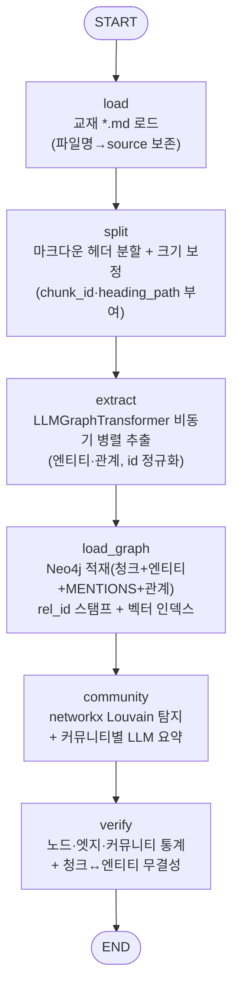

# 교재 GraphRAG 인덱서 (kg/indexer)

Agentic AI 학습 교재(마크다운 16장)를 개념(엔티티)·관계(엣지)·원문 청크로 정제하여
Neo4j 지식그래프로 적재하는 GraphRAG 인덱서임. 이후 검색 Retriever와 회귀 평가
(`prompts/testset-graphrag.md`)가 본 인덱서의 산출물(엔티티 ID·관계 ID·청크 ID)을 소비함.

## 1. 주요 기능

- 교재 마크다운 로드 → 헤더 기준 분할 → LLM 엔티티·관계 추출 → Neo4j 적재의 단일 파이프라인
- LangGraph 단일 워크플로우(6노드), 노드 간 데이터는 StateGraph의 State로 공유
- 엔티티·관계 추출: LangChain `LLMGraphTransformer` + Groq `gpt-oss-120b`(Structured Output)
- 추출 범위 제한: `config/graph_schema.yaml`의 allowed_nodes/allowed_relationships (하드코딩 금지)
- 안정적·재현 가능한 ID: `chunk_<n>` / `ent_<slug>` / `rel_<src>_<type>_<tgt>` (testset 정답과 일치)
- 원문 청크↔엔티티 역추적: `include_source`로 `(:Document)-[:MENTIONS]->(:__Entity__)` 적재
- 커뮤니티 탐지(주제 요약형 Global 검색 지원): networkx Louvain + 커뮤니티별 LLM 요약
- Local 검색·NDCG용 벡터 인덱스: 엔티티·청크 임베딩(OpenAI `text-embedding-3-large`)
- 중단 복구·재개: LangGraph `SqliteSaver` 체크포인트
- 재실행 멱등성: 동일 `chunk_id`·엔티티 id는 MERGE 기준 갱신

## 2. 사전 준비

### 2.1 Neo4j 전용 컨테이너 기동

Community Edition은 단일 DB만 지원하므로 타 프로젝트와 격리된 전용 컨테이너를 사용함
(APOC 플러그인 필요, 커뮤니티 탐지는 GDS 없이 Python측에서 수행).

```bash
docker run -d --name code-finder-neo4j \
  -p 7690:7687 -p 7476:7474 \
  -e NEO4J_AUTH=neo4j/codefinder \
  -e NEO4J_PLUGINS='["apoc"]' \
  -e NEO4J_dbms_security_procedures_unrestricted='apoc.*' \
  neo4j:5.26-community
```

- Bolt: `bolt://localhost:7690`, HTTP 브라우저: `http://localhost:7476`

### 2.2 환경변수(.env)

프로젝트 루트 `.env`에 아래 키가 필요함(시크릿은 코드와 분리).

```dotenv
GROQ_API_KEY=gsk_...              # 추출·요약 LLM (Groq gpt-oss-120b)
OPENAI_API_KEY=sk-...             # 임베딩 (text-embedding-3-large)
NEO4J_URI=bolt://localhost:7690
NEO4J_USERNAME=neo4j
NEO4J_PASSWORD=codefinder
NEO4J_DATABASE=neo4j
```

### 2.3 가상환경 설정 및 의존성 설치

OS·셸별 활성화 명령이 다름. 프로젝트 루트에서 실행함.

**Linux / macOS (bash·zsh)**

```bash
python3 -m venv .venv
source .venv/bin/activate
pip install -r requirements.txt
```

**Windows PowerShell**

```powershell
python -m venv .venv
.\.venv\Scripts\Activate.ps1
pip install -r requirements.txt
```

**Windows GitBash**

```bash
python -m venv .venv
source .venv/Scripts/activate
pip install -r requirements.txt
```

## 3. 실행 방법

프로젝트 루트에서 모듈로 실행함(`kg`가 패키지 루트).

```bash
# 전체 재인덱싱(그래프 초기화 후 16개 장 전체)
python -m kg.indexer.run --reset

# 스모크 테스트(앞 1개 장만)
python -m kg.indexer.run --reset --limit-chapters 1 --thread-id smoke-1

# 벡터 인덱스 생략(임베딩 비용 절감, 그래프만)
python -m kg.indexer.run --reset --no-vector
```

### 실행 옵션

| 옵션 | 설명 |
|------|------|
| `--reset` | 적재 전 그래프 전체 삭제(깨끗한 재인덱싱) |
| `--limit-chapters N` | 앞 N개 장만 처리(테스트용) |
| `--max-chunks N` | 앞 N개 청크만 처리(테스트용) |
| `--no-vector` | 벡터 인덱스 생성 생략 |
| `--thread-id ID` | 체크포인트 스레드 ID(재개 단위) |

## 4. 파이프라인 구성

LangGraph 단일 워크플로우. 각 노드 산출은 State(Reducer)로 다음 노드에 전달됨.



## 5. 디렉토리 구조

```
kg/
├─ indexer/
│  ├─ config/
│  │  ├─ graph_schema.yaml     # 엔티티/관계 타입 정의 (수정 지점)
│  │  └─ settings.py           # .env 로드 + 튜너블(청크 크기·동시성·시드 등)
│  ├─ nodes/
│  │  ├─ load.py               # 교재 로드
│  │  ├─ split.py              # 헤더 분할 + 크기 보정 + chunk_id
│  │  ├─ extract.py            # LLM 추출 + id 정규화(ent_<slug>, rel_id)
│  │  ├─ load_graph.py         # Neo4j 적재 + 벡터 인덱스
│  │  ├─ community.py          # Louvain + LLM 요약
│  │  └─ verify.py             # 통계 + 무결성 검증
│  ├─ ids.py                   # 안정 ID 규칙(chunk/entity/relation)
│  ├─ llm.py                   # Groq LLM · OpenAI 임베딩 팩토리
│  ├─ state.py                 # StateGraph State(TypedDict + Reducer)
│  ├─ pipeline.py              # 노드 조립(StateGraph)
│  ├─ run.py                   # CLI 진입점(증거 로그 출력)
│  └─ checkpoints/             # SqliteSaver 체크포인트(gitignore)
└─ store/
   └─ neo4j_store.py           # Neo4jGraph 래퍼(제약조건·적재·벡터·통계)
```

## 6. 엔티티/관계 타입 수정 방법

타입 목록은 코드가 아닌 **`kg/indexer/config/graph_schema.yaml`** 단일 파일에서 관리함.
아래 3개 키만 편집하면 다음 실행부터 반영됨(코드 수정 불필요).

- `allowed_nodes`: 엔티티 타입 목록 (예: Concept, Technique, Tool, Model, Framework)
- `allowed_relationships`: `[출발타입, 관계타입, 도착타입]` 3-튜플 목록
- `node_properties`: 엔티티에 함께 추출할 속성 (예: description)

확정된 스키마(사용자 검토 승인):

- 노드 5종: `Concept` · `Technique` · `Tool` · `Model` · `Framework`
- 관계 5종: `EXTENDS` · `USES` · `PREREQUISITE_OF` · `PART_OF` · `ALTERNATIVE_TO`

## 7. ID 체계 (testset-graphrag 연계)

`prompts/testset-graphrag.md`의 정답(gt_entities/gt_relations/gt_chunk_ids)이 그대로 소비하므로
동일 입력·동일 규칙에서 항상 같은 ID를 생성함.

| 종류 | 규칙 | 예시 |
|------|------|------|
| 청크 | `chunk_<전역순번>` (파일명 정렬→청크 순서) | `chunk_112` |
| 엔티티 | `ent_<slug>` (LLM 표기 흔들림을 slug로 흡수) | `ent_react` |
| 관계 | `rel_<src>_<type>_<tgt>` | `rel_react_extends_cot` |

- Document 노드는 `id = chunk_id`로 MERGE되어 재실행 시 멱등적으로 갱신됨
- 엔티티는 slug 정규화로 대소문자·표기 차이(예: `Neo4J`/`Neo4j`)를 하나로 병합함

## 8. 매핑 무결성 검증 (Cypher 예시)

특정 엔티티를 언급하는 원문 청크를 역추적함(검색 근거 제시용).

```cypher
MATCH (e:__Entity__ {id:"ent_graphrag"})<-[:MENTIONS]-(d:Document)
RETURN d.chunk_id, d.source, d.heading_path LIMIT 5;
```

커뮤니티 요약(주제 요약형 Global 검색) 조회:

```cypher
MATCH (c:Community) RETURN c.id, c.size, c.summary ORDER BY c.size DESC LIMIT 5;
```

## 9. 테스트

```bash
# 단위 테스트(외부 호출 없음 — Mock/fixture)
pytest

# 통합 테스트(실제 Neo4j·Groq·OpenAI 호출)
pytest -m integration
```

- 모듈별 단위 테스트(로더·스플리터·추출·적재·커뮤니티·검증)는 외부 의존을 Mock으로 대체함
- 실제 API·Neo4j 호출 테스트는 `integration` 마커로 분리되어 기본 실행에서 제외됨

## 10. 실행 결과(전체 16장 인덱싱 검증)

`python -m kg.indexer.run --reset` 후 `--retry-failed`로 실패분 보강 실측
(교재 16장, Groq gpt-oss-120b + text-embedding-3-large).

| 지표 | 값 |
|------|-----|
| 로드 장 수 | 16 |
| 청크 수 | 1206 |
| Document(청크 노드) | 1206 (전 청크 100% — 엔티티 없는 청크도 벡터 검색용 Document 적재) |
| ┗ 엔티티 보유 / bare | 1180 / 26 |
| 엔티티(`__Entity__`) | 4684 |
| 개념 간 관계(entity_rels) | 3159 (rel_id 커버리지 100%) |
| 전체 관계(MENTIONS·개념관계·IN_COMMUNITY) | 16493 |
| MENTIONS(청크↔엔티티) | 8517 |
| 커뮤니티 | 272 (관계 보유 엔티티 커뮤니티 미배정 0) |
| 엔티티 임베딩 / 청크 임베딩 | 4684 / 1206 |
| 고아 엔티티 | 0 |
| 무결성(`integrity_ok`) | True |

- 테스트: 단위 28 passed / integration 3 passed
- 역추적 검증 예: `ent_graphrag` → `chunk_464`(10.RAG)·`chunk_1022`(15.MCP) 등, `ent_langchain` → `chunk_330`(09.LangChain) 등
- 한글 엔티티 정상 보존: `ent_프롬프트_엔지니어링` 등(slug 유니코드 처리)

### 실패 청크 보강 워크플로우

추출 실패·엔티티 없음 청크는 `checkpoints/extract_report.json`에 기록됨.
`--retry-failed`는 리포트 실패분과 Neo4j 미적재(Document 없는) 청크만 재추출·적재함
(chunk_id가 전역 결정적이라 재현 가능). 실패 사유는 `empty`(정상, 재시도 안 함)·
`rate_limit`·`parse_error`로 분류되며, 재시도 대상은 동시성 1로 1회 순차 재시도함.

- 최초 실패 66건 → 재추출 후 잔여 2건(`parse_error`, 대형 표/코드 청크 추정)
- 잔여 실패 청크도 bare Document로 적재되어 벡터 검색 사각지대 없음
