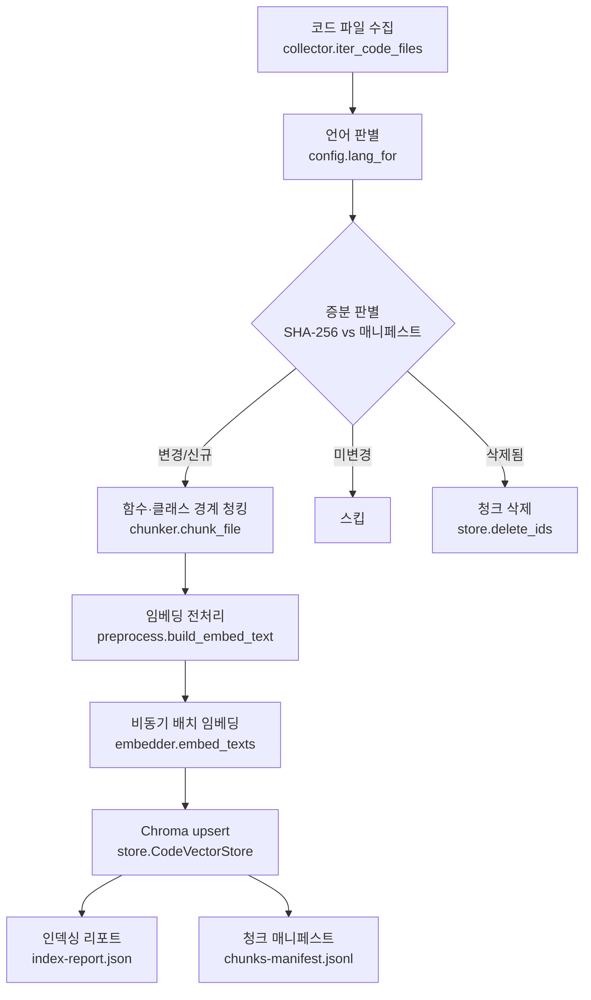

# 예제 코드 Vector DB 인덱싱 파이프라인

## 개요
Agentic AI 예제 코드(`~/workspace/aistudy/hands-on/*`)를 **함수·클래스 경계 단위로 청킹·임베딩**하여  
유사도 검색용 **Chroma Vector DB**로 구축하는 인덱싱 파이프라인임.  
code-finder의 코드 검색(자연어→코드, 코드→유사코드) 기능과 회귀 테스트의 기준 인덱스를 제공함.

### 주요 기능
- 코드 파일 재귀 수집 + 언어 판별(python·javascript·typescript·ipynb), 가상환경·빌드 산출물 제외
- 함수·클래스 경계 우선 청킹 — Python은 `ast` 기반 정밀 추출(symbol·signature·라인), JS/TS는 언어 스플리터 + 정규식 심볼 추출
- 임베딩 전처리 — `파일 경로 + 시그니처 + 독스트링` 프리픽스 결합
- OpenAI `text-embedding-3-large` 비동기 배치 임베딩 + 지수 백오프 재시도
- Chroma 영속화 + 청크 메타데이터 부여(`chunk_id`·`path`·`lang`·`symbol`·`signature`·`start_line`·`end_line`·`indexed_at`)
- 증분 인덱싱 — 파일 SHA-256 해시 비교로 변경분만 재인덱싱, 삭제 파일 청크 정리
- 인덱싱 리포트(`index-report.json`) + 다운스트림 대조용 청크 매니페스트(`chunks-manifest.jsonl`)

## 파이프라인 구성



### 청킹·임베딩 규칙 [고정]
| 항목 | 값 |
|------|-----|
| 청킹 사이즈 | 500 토큰 (tiktoken `cl100k_base` 기준) |
| 오버랩 | 100 토큰 |
| 구분자 | 코드: 함수·클래스 경계 우선(언어별 스플리터), 미지원 언어·파싱실패 시 토큰 폴백 |
| 임베딩 모델 | OpenAI `text-embedding-3-large` |
| Vector DB | Chroma (영속 디렉토리 `rag/store/chroma/`) |
| `chunk_id` 규칙 | `{상대경로}#{symbol}#{start_line}` (재현 가능·결정적, 충돌 시 `~N` 접미) |

## 가상환경 설정 및 실행

### 1) API Key 준비
프로젝트 루트 `.env`에 유효한 OpenAI 키가 필요함(Config·소스 분리).
```
OPENAI_API_KEY=sk-...
```

### 2) 가상환경 생성·활성화
`rag/` 디렉토리에서 실행함. (본 저장소는 [uv](https://docs.astral.sh/uv/) 사용)

```bash
# 가상환경 생성 (uv)
uv venv .venv --python 3.13
uv pip install --python .venv/bin/python -r requirements.txt
```

활성화 명령(OS별):
| 환경 | 명령 |
|------|------|
| Linux / macOS | `source .venv/bin/activate` |
| Windows GitBash | `source .venv/Scripts/activate` |
| Windows PowerShell | `.venv\Scripts\Activate.ps1` |

pip만 사용하는 경우:
```bash
python -m venv .venv        # 이후 위 표대로 활성화
pip install -r requirements.txt
```

### 3) 인덱서 실행
`rag/` 디렉토리에서:
```bash
python -m indexer --full          # 전체 재인덱싱(컬렉션 초기화)
python -m indexer                 # 증분 인덱싱(변경분만)
python -m indexer --limit 20      # 상위 20개 파일만(스모크)
python -m indexer --dry-run       # 임베딩·적재 없이 수집·청킹·전처리만(키 불필요)
python -m indexer --sample-only   # 인덱싱 없이 샘플 질의만 실행
```

실행 시 진행 단계·처리 건수(수집·청킹·임베딩·적재)가 로그로 출력되며,  
완료 후 3건의 샘플 질의에 대한 top-5 검색 결과가 함께 출력됨.

### 4) 테스트
```bash
python -m pytest              # 단위 테스트(외부 API 호출 없음)
python -m pytest -m integration   # 통합 테스트(실제 OpenAI 호출, 키 필요)
```

## 디렉토리 구조

```
rag/
├── indexer/                 # 인덱서 패키지
│   ├── __init__.py
│   ├── __main__.py          # CLI 진입점(argparse) — python -m indexer
│   ├── config.py            # 설정 로더(.env 키, 경로·모델·청킹 파라미터, 제외 규칙)
│   ├── collector.py         # 파일 재귀 수집 + 언어 판별 + SHA-256 해시
│   ├── chunker.py           # 함수·클래스 경계 청킹(AST/언어 스플리터/폴백)
│   ├── preprocess.py        # 임베딩 프리픽스 결합(경로+시그니처+독스트링)
│   ├── embedder.py          # OpenAI 비동기 배치 임베딩 + 지수 백오프 재시도
│   ├── store.py             # Chroma 저장소 래퍼 + 메타데이터 + 파일 매니페스트
│   └── pipeline.py          # 워크플로우 오케스트레이션 + 리포트 산출
├── tests/                   # pytest 단위·통합 테스트
│   ├── test_collector.py
│   ├── test_chunker.py
│   ├── test_preprocess.py
│   ├── test_embedder.py     # Mock 기반 배치·백오프 검증
│   ├── test_store.py        # 오프라인 Chroma upsert/count/delete 검증
│   └── test_pipeline_integration.py  # @integration (실제 OpenAI)
├── store/                   # 산출물
│   ├── chroma/              # Chroma 영속 디렉토리(gitignore)
│   ├── index-report.json    # 인덱싱 리포트(실제 실행 시 생성)
│   ├── chunks-manifest.jsonl# 청크 메타데이터(testset-rag 대조용)
│   └── file-manifest.json   # 증분 인덱싱용 파일 해시·청크ID
├── requirements.txt
├── pyproject.toml           # pytest 설정(pythonpath·asyncio·integration 마커)
└── README.md
```

### 주요 소스 설명
- **config.py** — `Settings` 데이터클래스. `.env`에서 `OPENAI_API_KEY`만 로드하고, 경로·모델·청킹 파라미터·제외 규칙은 코드 기본값으로 관리하여 비밀정보와 설정을 분리함.
- **collector.py** — `base_dir` 하위를 재귀 순회, 지원 확장자만 수집. `.venv`·`node_modules`·`__pycache__` 등 제외, 빈 파일·초대형 파일(>400KB) 스킵, 파일 내용 SHA-256으로 증분 판별. **경로 글로브 제외**(`exclude_globs`)로 실행 코드가 아닌 파일을 배제 — 기본값은 `explain/data.js`(예제 설명 페이지 콘텐츠 데이터, 77건). CLI `--exclude GLOB`로 패턴 추가 가능.
- **chunker.py** — Python은 `ast`로 최상위 함수/클래스를 정밀 추출(데코레이터 포함 시작 라인, 시그니처, 독스트링, `end_lineno`)하고 경계 밖 코드는 `<module>` 세그먼트로 수집. 500토큰 초과 심볼은 하위 분할. JS/TS는 언어 스플리터 + 정규식 심볼 추출. 파싱 실패·미지원은 토큰 폴백.
- **preprocess.py** — 각 청크 앞에 `# path:`/`# signature:`/`# doc:` 프리픽스를 결합하여 코드 검색 재현율을 높임.
- **embedder.py** — `aembed_documents` 비동기 호출을 배치·세마포어로 병렬화하고, 429·타임아웃·5xx는 지수 백오프로 재시도하되 인증·요청 오류는 즉시 전파.
- **store.py** — `langchain_chroma.Chroma`를 래핑. 사전 계산 임베딩을 `upsert`하고 메타데이터를 부여. 파일 매니페스트(경로→해시·청크ID) 관리.
- **pipeline.py** — 수집→청킹→전처리→임베딩→적재 오케스트레이션. 증분 인덱싱과 리포트·매니페스트 산출을 담당. `--dry-run`은 임베딩 전단만 실증.

## 후속 연계
- 청크 메타데이터(`chunk_id`·`path`·`symbol`)는 `prompts/testset-rag.md`의 `gt_chunk_ids`·`gt_paths` 대조 기준이 됨.
- 실제 인덱스의 청크 목록은 `store/chunks-manifest.jsonl`로 제공됨.

## 설계 메모
- **세션 체크포인트**: 본 파이프라인은 대화형 에이전트가 아닌 배치 인덱서이므로, 중단·재개는 LangGraph 체크포인터가 아니라 **파일 해시 기반 증분 인덱싱**(`file-manifest.json`)으로 구현함. 재실행 시 이미 인덱싱된 미변경 파일은 자동 스킵됨.
- **LCEL 실행 방식**: 배치·백그라운드 처리이므로 가이드 §3.1 기준에 따라 비동기(`aembed_documents`)를 채택함.
